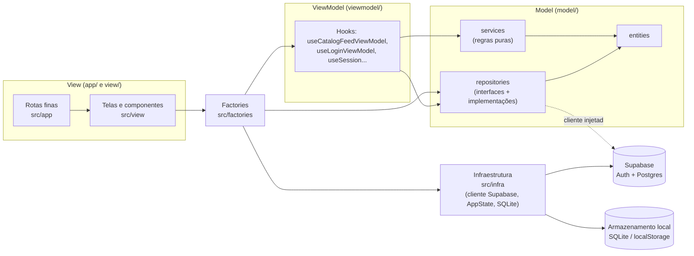
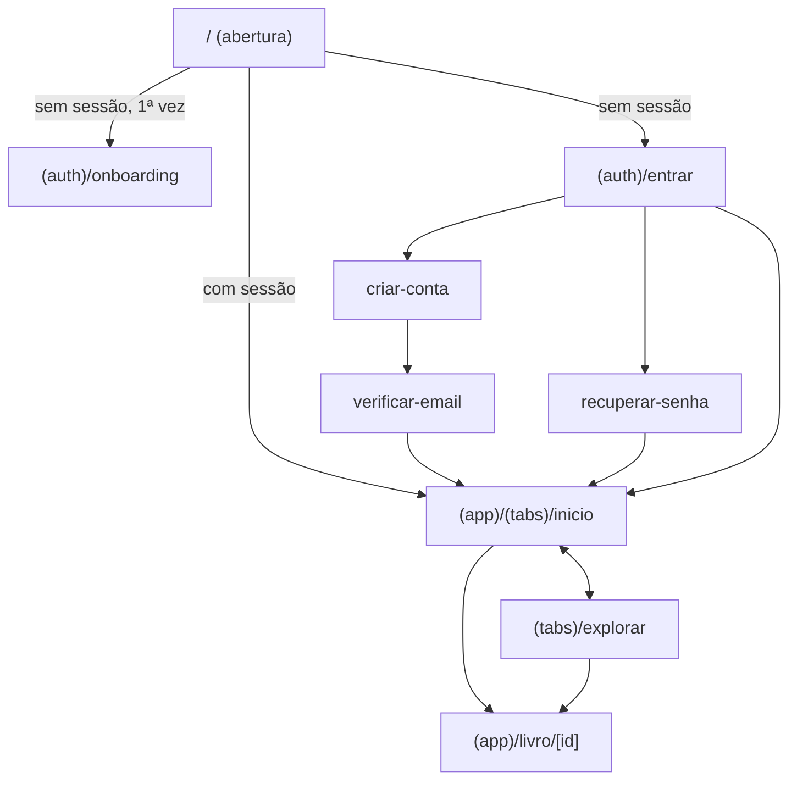
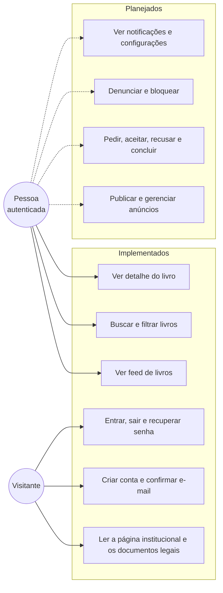
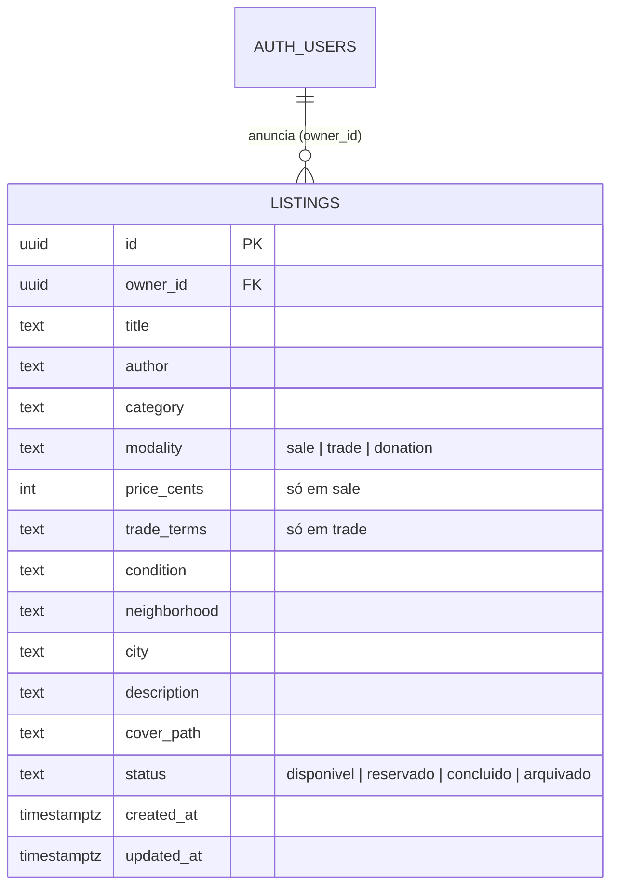
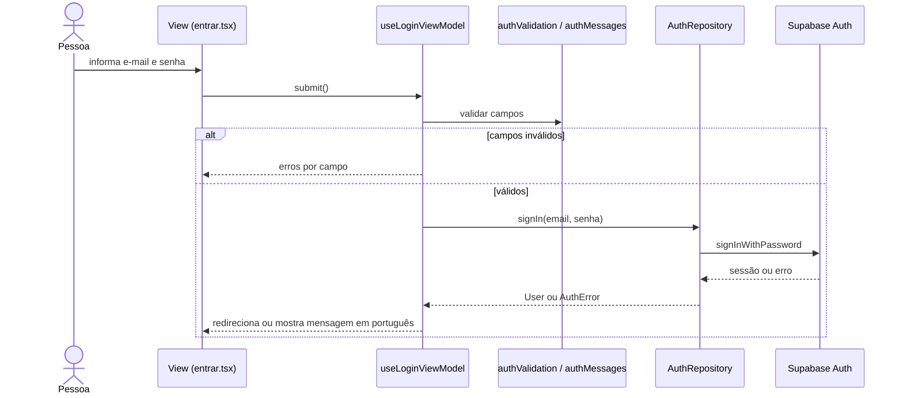
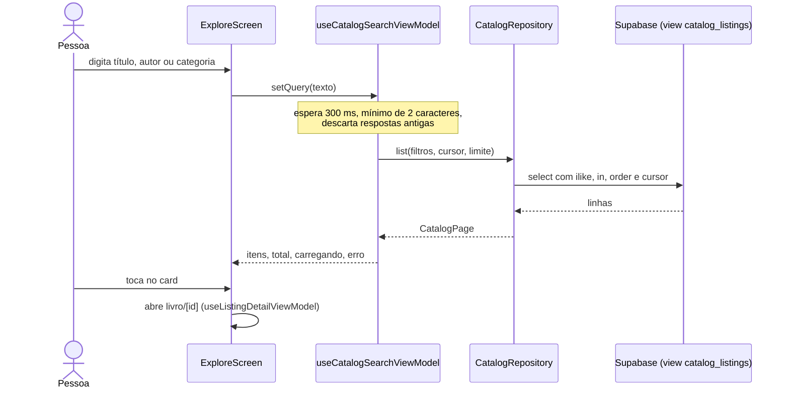

# Relatório de PDM — IpêBook

> **Rascunho** (issue #48). A estrutura, os diagramas e as seções do Catálogo e da Autenticação partem do que já existe no repositório. As seções marcadas com **A preencher** são de cada pessoa da equipe e dependem de features ainda não implementadas. Atualizado em 01/10/2026.

**Equipe:** Maria Clara Almeida Martins, Micael Cardoso Reis, Antonio Carlos Gomes e Eric Vinícius dos Santos Oliveira.

## 1. Visão geral

O IpêBook é um aplicativo comunitário para venda, troca e doação de livros em Piripiri (PI). O aplicativo roda em Android e iOS (Expo / React Native). A Web tem apenas uma página institucional ([ADR 0004](adr/0004-pagina-institucional-web.md) e [ADR 0005](adr/0005-navegacao-expo-router.md)). O backend é o Supabase: autenticação e Postgres com Row Level Security ([ADR 0006](adr/0006-autenticacao-supabase.md) e [ADR 0008](adr/0008-modelo-de-anuncios-supabase.md)).

## 2. Requisitos

Os requisitos detalhados ficam nas specs em [`specs/`](../specs). Resumo por feature:

| Feature (responsável)                   | Requisitos principais                                                                                                   | Spec                                                                       | Situação                                            |
| --------------------------------------- | ----------------------------------------------------------------------------------------------------------------------- | -------------------------------------------------------------------------- | --------------------------------------------------- |
| Autenticação e onboarding (Maria Clara) | RF1 criar conta; RF2 confirmar e-mail por código; RF3 entrar e sair; RF4 recuperar senha; RF5 onboarding na 1ª abertura | [014](../specs/014-autenticacao-onboarding)                                | Implementada; validação em aparelho aberta          |
| Catálogo (Micael)                       | RF6 ver feed; RF7 buscar e filtrar por modalidade; RF8 ver detalhe do livro                                             | [018](../specs/018-catalogo-descoberta)                                    | Implementada; conferência com anúncios reais aberta |
| Configurações e notificações (Micael)   | RF9 ver avisos; RF10 ajustar preferências                                                                               | [024](../specs/024-configuracoes-notificacoes)                             | Apenas especificada (extra)                         |
| Anúncios e perfil (Eric)                | RF11 criar, editar, arquivar e excluir anúncio; RF12 ver "Minhas publicações" e perfil                                  | **A preencher** (issues #36 e #37)                                         | Não implementada                                    |
| Negociação e segurança (Antonio)        | RF13 pedir o livro; RF14 aceitar ou recusar; RF15 concluir; RF16 denunciar e bloquear                                   | **A preencher** (issues #38 e #40)                                         | Não implementada                                    |
| Página institucional Web                | Apresentar o projeto, estante de exemplos e documentos legais                                                           | [001](../specs/001-pagina-institucional) a [023](../specs/023-rotas-reais) | Implementada                                        |

**Requisitos não funcionais:** português do Brasil; alvos de toque de 48 × 48; rótulos acessíveis em ícones e cards; texto ampliável; respeito a movimento reduzido; estados de carregamento, vazio, erro e sem conexão; preço em BRL apenas na venda; dados de exemplo nunca apresentados como reais; segredos fora do repositório; Política de Privacidade coerente com os dados coletados.

## 3. Arquitetura

O projeto usa o **MVVM Simplificado** da disciplina ([ADR 0002](adr/0002-adotar-mvvm-pdm.md)). O Model não conhece React; as ViewModels são Custom Hooks sem JSX; as Views só exibem dados e disparam ações.

**Regra de dependência:** View → ViewModel → Model. O Model não importa React, React Native nem Expo: o cliente Supabase e o armazenamento ficam em `src/infra/` e as factories os injetam nos repositórios ([ADR 0012](adr/0012-camada-de-infraestrutura.md); verificado por `tests/architecture.test.mjs`). O Supabase só aparece nas implementações de repositório. Nos testes, as ViewModels recebem repositórios em memória.

**Navegação:** Expo Router com dois grupos, `(auth)` e `(app)`. Os layouts redirecionam conforme a sessão.

## 4. Casos de uso

## 5. Modelo de dados (Supabase)

Definido no [ADR 0008](adr/0008-modelo-de-anuncios-supabase.md) e na migração `supabase/migrations/20260930120000_catalogo_anuncios.sql`.

O catálogo lê somente a view `catalog_listings` (anúncios `disponivel` ou `reservado` de outras pessoas, com o primeiro nome de quem anunciou). A RLS permite que cada pessoa leia anúncios visíveis e crie, altere e exclua só os próprios.

## 6. Fluxos principais

### 6.1 Entrar

### 6.2 Descobrir um livro

## 7. Padrões de projeto

| Padrão                      | Onde está                                                                      | Para que serve                                                             |
| --------------------------- | ------------------------------------------------------------------------------ | -------------------------------------------------------------------------- |
| MVVM Simplificado           | `src/model`, `src/viewmodel`, `src/view`, `src/app`                            | Separar regra de negócio, estado de tela e interface                       |
| Repository                  | `AuthRepository`, `CatalogRepository` e suas implementações Supabase e memória | Esconder o acesso a dados e trocar a fonte nos testes                      |
| Factory                     | `src/factories/auth.ts` e `catalog.ts`                                         | Montar as dependências reais e entregar hooks prontos às telas             |
| Injeção de dependência      | ViewModels recebem o repositório por parâmetro                                 | Testar sem rede nem Supabase                                               |
| Adapter / tradução de erros | `supabaseAuthRepository`, `supabaseCatalogRepository`                          | Converter erros do Supabase em códigos do domínio e mensagens em português |
| Funções puras no Model      | `catalogFormat`, `catalogFilters`, `userFormat`, `authValidation`              | Regras testáveis sem React                                                 |

## 8. Qualidade e testes

- `npm run verify`: tipos (`tsc` estrito), lint, formatação (Prettier) e testes.
- 79 testes automatizados em `tests/` (Model, ViewModels, repositórios com cliente falso, rotas e design system) em 01/10/2026.
- CI no GitHub Actions; hooks de commit com Husky, commitlint e lint-staged.
- Limites conhecidos: a validação em aparelho real, com anúncios de outra conta, ainda está pendente (issues #28 e #44).

## 9. Seções individuais

### 9.1 Autenticação e onboarding — Maria Clara

**A preencher:** decisões, dificuldades, telas e como foi testado (spec 014, ADR 0006).

### 9.2 Catálogo, configurações e notificações — Micael

**A preencher:** decisões de busca e paginação por cursor, refatoração para MVVM (spec 018), proposta de notificações (spec 024, ADR 0011).

### 9.3 Negociação e segurança — Antonio

**A preencher** após a implementação (issues #38 e #40).

### 9.4 Anúncios e perfil — Eric

**A preencher** após a implementação (issues #36 e #37). Incluir o ciclo de vida do anúncio (`disponivel` → `reservado` → `concluido` / `arquivado`).

## 10. Decisões arquiteturais

Índice completo em [`adr/index.md`](adr/index.md). Os ADRs 0008 e 0011 ainda estão **propostos**.

## 11. Pendências do relatório

- Completar as seções 9.1 a 9.4 e o diagrama de casos de uso com as features restantes.
- Atualizar a tabela de requisitos quando #36 e #38 forem concluídas.
- Revisão final pelo grupo (critério de aceite da issue #48).
