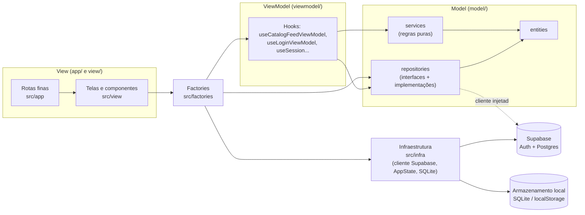
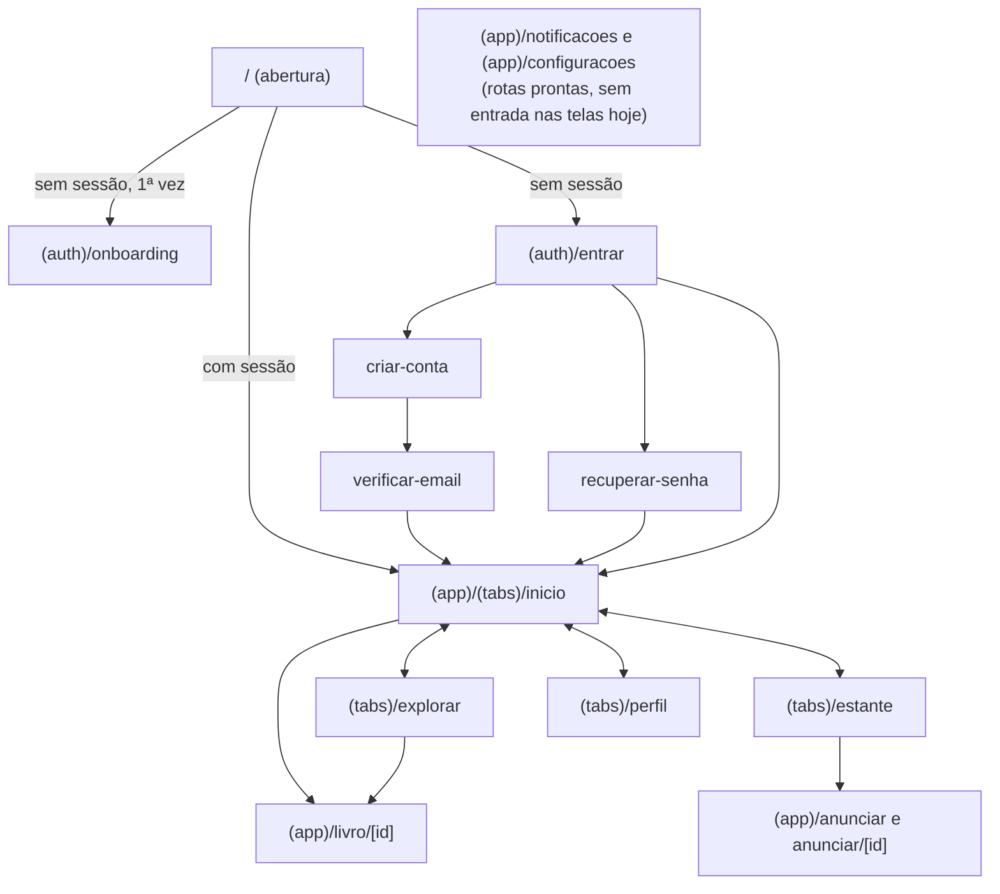
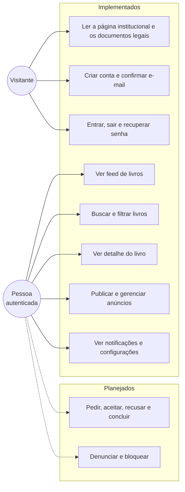
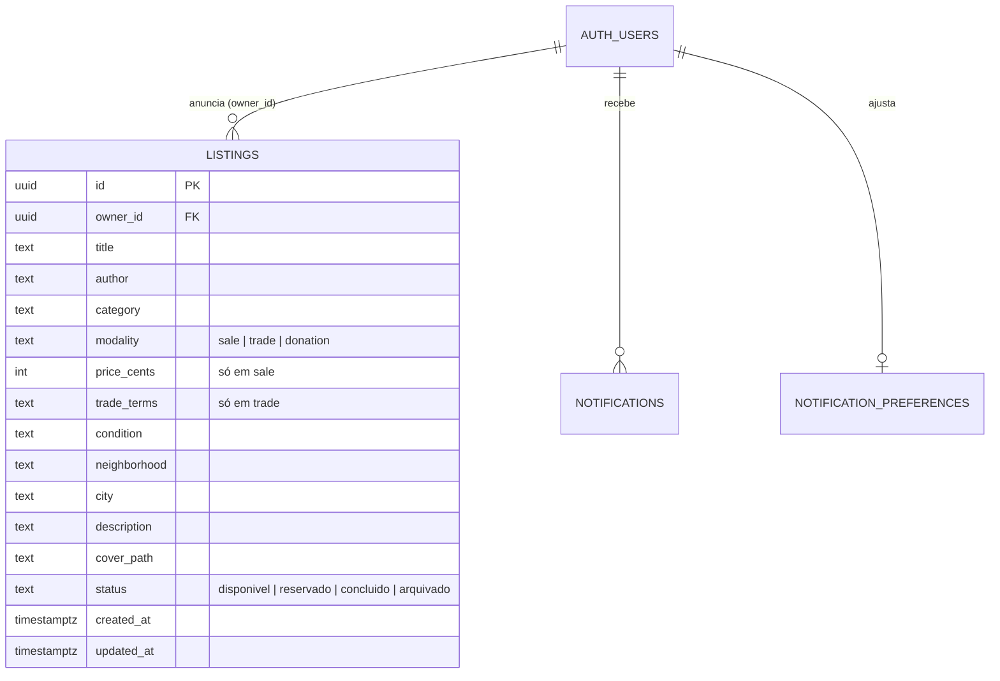
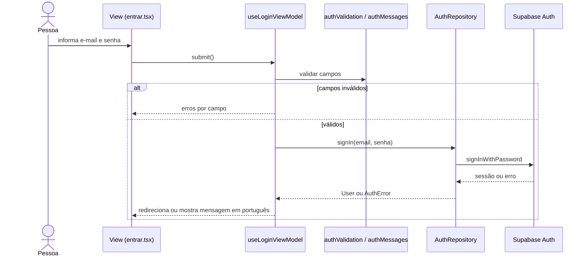
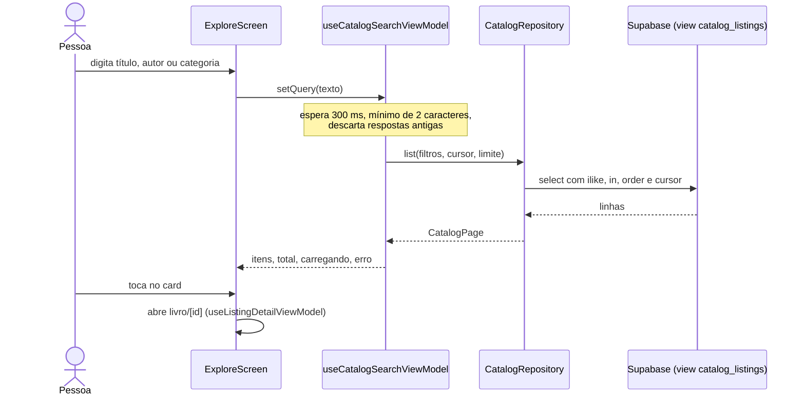
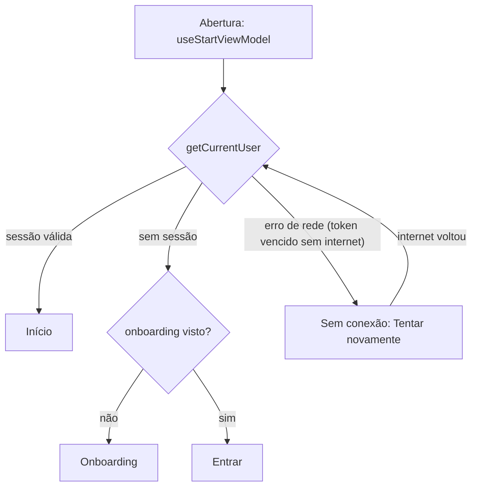

# Relatório de PDM — IpêBook

> **Rascunho** (issue #48). A estrutura, os diagramas e as seções do Catálogo e da Autenticação partem do que já existe no repositório. As seções marcadas com **A preencher** são de cada pessoa da equipe e dependem de features ainda não implementadas. Atualizado em 02/10/2026.

**Equipe:** Maria Clara Almeida Martins, Micael Cardoso Reis, Antonio Carlos Gomes e Eric Vinícius dos Santos Oliveira.

## 1. Visão geral

O IpêBook é um aplicativo comunitário para venda, troca e doação de livros em Piripiri (PI). O aplicativo roda em Android e iOS (Expo / React Native). A Web tem apenas uma página institucional ([ADR 0004](adr/0004-pagina-institucional-web.md) e [ADR 0005](adr/0005-navegacao-expo-router.md)). O backend é o Supabase: autenticação e Postgres com Row Level Security ([ADR 0006](adr/0006-autenticacao-supabase.md) e [ADR 0008](adr/0008-modelo-de-anuncios-supabase.md)).

## 2. Requisitos

Os requisitos detalhados ficam nas specs em [`specs/`](../specs). Resumo por feature:

| Feature (responsável)                   | Requisitos principais                                                                                                   | Spec                                                                       | Situação                                            |
| --------------------------------------- | ----------------------------------------------------------------------------------------------------------------------- | -------------------------------------------------------------------------- | --------------------------------------------------- |
| Autenticação e onboarding (Maria Clara) | RF1 criar conta; RF2 confirmar e-mail por código; RF3 entrar e sair; RF4 recuperar senha; RF5 onboarding na 1ª abertura | [014](../specs/014-autenticacao-onboarding)                                | Implementada; validação em aparelho aberta          |
| Catálogo (Micael)                       | RF6 ver feed; RF7 buscar e filtrar por modalidade; RF8 ver detalhe do livro                                             | [018](../specs/018-catalogo-descoberta)                                    | Implementada; conferência com anúncios reais aberta |
| Configurações e notificações (Micael)   | RF9 ver avisos; RF10 ajustar preferências                                                                               | [024](../specs/024-configuracoes-notificacoes)                             | Implementada (extra); validação em aparelho aberta  |
| Anúncios e perfil (Eric)                | RF11 criar, editar, arquivar e excluir anúncio; RF12 ver "Minhas publicações" e perfil                                  | [025](../specs/025-anuncios-gestao) e [026](../specs/026-perfil-minimo)    | Implementada; validação em aparelho aberta          |
| Negociação e segurança (Antonio)        | RF13 pedir o livro; RF14 aceitar ou recusar; RF15 concluir; RF16 denunciar e bloquear                                   | **A preencher** (issues #38 e #40)                                         | Não implementada                                    |
| Página institucional Web                | Apresentar o projeto, estante de exemplos e documentos legais                                                           | [001](../specs/001-pagina-institucional) a [023](../specs/023-rotas-reais) | Implementada                                        |

**Requisitos não funcionais:** português do Brasil; alvos de toque de 48 × 48; rótulos acessíveis em ícones e cards; texto ampliável; respeito a movimento reduzido; estados de carregamento, vazio, erro e sem conexão; preço em BRL apenas na venda; dados de exemplo nunca apresentados como reais; segredos fora do repositório; Política de Privacidade coerente com os dados coletados.

## 3. Arquitetura

O projeto usa o **MVVM Simplificado** da disciplina ([ADR 0002](adr/0002-adotar-mvvm-pdm.md)). O Model não conhece React; as ViewModels são Custom Hooks sem JSX; as Views só exibem dados e disparam ações.



**Regra de dependência:** View → ViewModel → Model. O Model não importa React, React Native nem Expo: o cliente Supabase e o armazenamento ficam em `src/infra/` e as factories os injetam nos repositórios ([ADR 0012](adr/0012-camada-de-infraestrutura.md); verificado por `tests/architecture.test.mjs`). O Supabase só aparece nas implementações de repositório. Nos testes, as ViewModels recebem repositórios em memória.

**Navegação:** Expo Router com dois grupos, `(auth)` e `(app)`. Os layouts redirecionam conforme a sessão.



## 4. Casos de uso



## 5. Modelo de dados (Supabase)

Definido no [ADR 0008](adr/0008-modelo-de-anuncios-supabase.md) e no [ADR 0011](adr/0011-entrega-de-notificacoes.md), com as migrações `supabase/migrations/20260930120000_catalogo_anuncios.sql` e `20261002120000_notificacoes.sql`.



As tabelas `notifications` e `notification_preferences` (colunas na migração) têm RLS: cada pessoa lê e altera só as suas, e os avisos são criados apenas pela função `create_notification`, chamada por gatilhos do banco.

O catálogo lê somente a view `catalog_listings` (anúncios `disponivel` ou `reservado` de outras pessoas, com o primeiro nome de quem anunciou). A RLS permite que cada pessoa leia anúncios visíveis e crie, altere e exclua só os próprios.

## 6. Fluxos principais

### 6.1 Entrar



### 6.2 Descobrir um livro



### 6.3 Recuperar senha

```mermaid
sequenceDiagram
  actor U as Pessoa
  participant VM as usePasswordRecoveryViewModel
  participant R as supabaseAuthRepository
  participant G as userChangeGate
  participant S as Supabase Auth
  participant L as layout (auth)
  U->>VM: código, nova senha e confirmação
  VM->>VM: valida a senha antes de confirmar o código
  VM->>R: resetPassword(email, código, senha)
  R->>G: hold()
  R->>S: verifyOtp(recovery)
  S-->>G: aviso de sessão (retido)
  R->>S: updateUser(senha)
  alt gravação falhou
    S-->>R: erro
    R-->>VM: AuthError (portão continua fechado)
    VM-->>U: erro no formulário; nova tentativa sem novo código
  else senha gravada
    S-->>R: usuário
    R->>G: release(usuário)
    G-->>L: sessão iniciada
    L-->>U: vai para a Início
  end
```

### 6.4 Abrir o app com sessão salva



## 7. Padrões de projeto

| Padrão                      | Onde está                                                                                                                     | Para que serve                                                                            |
| --------------------------- | ----------------------------------------------------------------------------------------------------------------------------- | ----------------------------------------------------------------------------------------- |
| MVVM Simplificado           | `src/model`, `src/viewmodel`, `src/view`, `src/app`                                                                           | Separar regra de negócio, estado de tela e interface                                      |
| Repository                  | `AuthRepository`, `CatalogRepository`, `ListingsRepository` e `NotificationRepository`, com implementações Supabase e memória | Esconder o acesso a dados e trocar a fonte nos testes                                     |
| Factory                     | `src/factories/` (`auth`, `catalog`, `listings`, `notifications`, `readingMode`)                                              | Montar as dependências reais e entregar hooks prontos às telas                            |
| Injeção de dependência      | ViewModels recebem o repositório por parâmetro                                                                                | Testar sem rede nem Supabase                                                              |
| Adapter / tradução de erros | `supabaseAuthRepository`, `supabaseCatalogRepository`, `supabaseListingsRepository`, `supabaseNotificationRepository`         | Converter erros do Supabase em códigos do domínio e mensagens em português                |
| Funções puras no Model      | `catalogFormat`, `catalogFilters`, `userFormat`, `authValidation`, `listingValidation`, `listingFormat`, `notificationFormat` | Regras testáveis sem React                                                                |
| Observer com portão         | `userChangeGate` e `onUserChange`                                                                                             | Avisar as ViewModels sobre entrada e saída, retendo avisos durante a recuperação de senha |
| Camada de infraestrutura    | `src/infra/` (ADR 0012)                                                                                                       | Isolar SDKs e recursos da plataforma do Model                                             |

## 8. Qualidade e testes

- `npm run verify`: tipos (`tsc` estrito), lint, formatação (Prettier) e testes.
- 185 testes automatizados em `tests/` (Model, ViewModels, repositórios com cliente falso e supabase-js real, rotas, design system e arquitetura) em 02/10/2026.
- `tests/architecture.test.mjs` impede que o Model importe React, React Native ou Expo e que Views importem repositórios.
- CI no GitHub Actions; hooks de commit com Husky, commitlint e lint-staged.
- Limites conhecidos: nenhuma tela do app foi validada em aparelho real ainda (issues #12, #28 e #44); os `verify.md` das specs 013, 014, 024, 025 e 026 registram o que falta.

## 9. Seções individuais

### 9.1 Autenticação e onboarding — Maria Clara

**Escopo** ([divisão de features](DIVISAO_FEATURES.md)): abertura, onboarding, criar conta, confirmar e-mail, entrar, recuperar senha e sair, além da base transversal do app (navegação, tema nativo, componentes de formulário e estados de carregamento, vazio, erro e sem conexão). Specs [013](../specs/013-base-app-nativo/spec.md) e [014](../specs/014-autenticacao-onboarding/spec.md).

#### Requisitos e onde estão no código

| Requisito                       | Telas (`src/view/screens`)                      | ViewModel                                       | Repositório                                                       |
| ------------------------------- | ----------------------------------------------- | ----------------------------------------------- | ----------------------------------------------------------------- |
| RF1 criar conta                 | `auth/SignUpScreen`                             | `useSignUpViewModel`                            | `signUp`                                                          |
| RF2 confirmar e-mail por código | `auth/VerifyEmailScreen`                        | `useVerifyEmailViewModel` (reenvio a cada 60 s) | `verifySignUp`, `resendSignUpCode`                                |
| RF3 entrar e sair               | `auth/LoginScreen`, Início do catálogo ("Sair") | `useLoginViewModel`, `useSession`               | `signIn`, `signOut`                                               |
| RF4 recuperar senha             | `auth/PasswordRecoveryScreen` (2 etapas)        | `usePasswordRecoveryViewModel`                  | `requestPasswordReset`, `resetPassword`, `cancelPasswordRecovery` |
| RF5 onboarding na 1ª abertura   | `StartScreen`, `OnboardingScreen`               | `useStartViewModel`, `useOnboardingViewModel`   | `preferencesRepository`                                           |
| Manter a sessão entre aberturas | `StartScreen`, `SessionPendingScreen`           | `useSession` (`restoreError`, `retryRestore`)   | `getCurrentUser`, `onUserChange`                                  |

#### Decisões

- **Supabase Auth com código (OTP) por e-mail**, em vez de link ([ADR 0006](adr/0006-autenticacao-supabase.md)): o mesmo fluxo funciona no Expo Go, em build e na Web, sem deep links nem URLs de redirecionamento.
- **Expo Router só no Android e no iOS** ([ADR 0005](adr/0005-navegacao-expo-router.md)): com o roteador, a página institucional passaria de 112 KB para 402 KB de JavaScript inicial e o LCP medido, de cerca de 2 s para 5 s. A Web manteve a entrada própria.
- **Contrato `AuthRepository`** com duas implementações, Supabase e memória. As ViewModels recebem o repositório por parâmetro e as factories (`src/factories/auth.ts`) injetam o real. Os erros do Supabase viram códigos do domínio (`AuthError`) e mensagens em português (`authMessages`); a tela nunca mostra `invalid_credentials`.
- **Validação local antes do servidor** (`authValidation`): nome, e-mail, senha com 8 caracteres e letras e números, confirmação e código. Os dados digitados são preservados após o erro.
- **Portão de mudanças de sessão** (`userChangeGate`, issue #8): confirmar o código de recuperação já cria uma sessão no Supabase, antes de a nova senha ser gravada. O portão retém esse aviso até a senha ser salva; se a gravação falhar, a pessoa continua no formulário e pode tentar de novo sem pedir outro código.
- **Sessão salva sem internet não é saída** (issue #34): com o token vencido e sem rede, o Supabase mantém a sessão, mas devolve erro de rede. O app mostra "Sem conexão" e "Tentar novamente" em vez de mandar para Entrar.
- **Camada de infraestrutura** (`src/infra/`, [ADR 0012](adr/0012-camada-de-infraestrutura.md), issue #33): o cliente Supabase, a renovação do token pelo `AppState` e o armazenamento em SQLite saíram do Model.
- **Controles próprios seguindo o Figma** ([ADR 0013](adr/0013-controles-proprios-seguindo-o-figma.md), issue #9): `Button` (pílula, variantes Preenchido, Contornado, Texto e Perigo) e `TextField` (rótulo dentro da caixa, erro com ícone e mensagem), sem biblioteca externa.

#### Dificuldades e como foram resolvidas

| Dificuldade                                                                         | Solução                                                                                                     |
| ----------------------------------------------------------------------------------- | ----------------------------------------------------------------------------------------------------------- |
| Na recuperação, a pessoa era levada para a Início antes de a senha ser gravada (#8) | Portão de sessão no Model e teste que reproduz a ordem real do Supabase                                     |
| O app voltava para Entrar ao reiniciar (#34)                                        | Investigação com o supabase-js real: a causa era o erro de rede de `getSession` tratado como "sem sessão"   |
| O Expo Router deixava a página institucional lenta                                  | Medição de tamanho e LCP; o roteador ficou restrito ao app nativo                                           |
| O Model dependia de React Native e Expo (#33)                                       | `src/infra/` e teste de arquitetura que impede a volta                                                      |
| A tela de abertura lia o repositório direto (#32)                                   | `useStartViewModel`; teste garante que nenhuma View importa repositório                                     |
| A Política de Privacidade dizia que o site não usava análise de visitas, mas usava  | Documentos legais corrigidos junto com o cadastro (PR #7)                                                   |
| Telas do Figma indisponíveis para comparação (#10, #11, #35)                        | Componentes conferidos com a página "05 · Componentes"; as telas seguem bloqueadas e registradas nas issues |

#### Telas

Abertura com a marca; boas-vindas numa tela só (marca, cidade, ilustração e Venda/Troca/Doação), com Começar e Já tenho conta; Entrar; Criar conta; Confirmar e-mail; Recuperar senha (pedir código, depois código e nova senha); aviso "Sem conexão" na abertura e faixa de conexão nas áreas `(auth)` e `(app)`.

#### Como foi testado

- **30 testes automatizados da feature:** 12 de Model e repositório (`tests/auth-model.test.mjs`), 16 de ViewModel (`tests/auth-viewmodel.test.mjs`) e 2 de arquitetura (`tests/architecture.test.mjs`).
- Repositório Supabase testado com **cliente falso** (parâmetros, tradução de erros, ordem dos eventos da recuperação) e com o **supabase-js real** em memória (restauração da sessão ao reabrir e sessão recusada).
- ViewModels testadas com o **repositório em memória**: validação, envio duplo, código inválido, reenvio, recuperação com falha e nova tentativa, sessão sem internet e destino da abertura.
- Exportação dos bundles Android e iOS e build Web a cada PR; CI no GitHub Actions.
- Componentes conferidos numa prévia com react-native-web, comparada com as capturas do Figma.

#### Limites e próximos passos

- Teste ponta a ponta num aparelho Android e num iPhone, com o Supabase real e leitor de tela: issue #12.
- Configurar o código nos e-mails do Supabase: issue #31. Excluir a conta, junto com o Eric: issue #47.
- Comparar telas e estados com o Figma quando as páginas forem publicadas: issues #11 e #35; adequação do iOS: issue #10.

### 9.2 Catálogo, configurações e notificações — Micael

**A preencher:** decisões de busca e paginação por cursor, refatoração para MVVM (spec 018), proposta de notificações (spec 024, ADR 0011).

### 9.3 Negociação e segurança — Antonio

**A preencher** após a implementação (issues #38 e #40).

### 9.4 Anúncios e perfil — Eric

Esta é a feature que cumpre o requisito obrigatório **"dados que o usuário cria, edita e exclui"**: nenhuma outra parte do aplicativo grava dado do usuário.

**Ciclo de vida do anúncio.** Um anúncio nasce `disponivel`. A negociação o leva a `reservado` e depois a `concluido`; quem anunciou pode levá-lo a `arquivado` e trazê-lo de volta. As quatro situações estão na tabela `listings` (ADR 0008), e o catálogo só enxerga `disponivel` e `reservado`.

Uma regra que atravessa a feature inteira: **só anúncio `disponivel` pode ser editado, arquivado ou excluído**. Reservado e concluído são só leitura, porque quem manda neles é a negociação — mexer no preço de um livro já prometido quebraria o combinado com a outra pessoa. A tela diz o motivo em vez de desabilitar botões em silêncio.

**Camadas (MVVM Simplificado).**

| Camada      | Arquivos                                                                                                                                                                    |
| ----------- | --------------------------------------------------------------------------------------------------------------------------------------------------------------------------- |
| Model       | `entities/Listing.ts` (`MyListing`, `ListingDraft`), `entities/ListingError.ts`, `services/listingValidation.ts`, `services/listingFormat.ts`, `services/profileSummary.ts` |
| Repositório | `ListingsRepository` (porta), `memoryListingsRepository` (testes) e `supabaseListingsRepository` (o único que conhece o Supabase)                                           |
| ViewModel   | `useListingForm`, `usePublishListingViewModel`, `useEditListingViewModel`, `useMyListingsViewModel`                                                                         |
| View        | `screens/listings/` (publicar, editar), `screens/profile/` (estante, perfil), `components/listings/`                                                                        |

**Decisões registradas no [ADR 0014](adr/0014-gestao-de-anuncios.md).** Quatro delas têm efeito visível: a foto nasce com nome único porque o bucket não aceita sobrescrita; excluir o anúncio apaga a foto antes da linha, já que o bucket é público; a troca de modalidade grava os três campos juntos, porque as constraints olham a linha inteira; e as situações da gestão ganharam tipo próprio para não mexer no código do catálogo.

**Dinheiro em centavos, `integer`.** `parseBRLToCents` converte sobre os dígitos, nunca multiplicando o número: `19.90 * 100` dá 1989,9999… em ponto flutuante, e um centavo perdido por anúncio vira reclamação.

**O que ainda falta:** conferência em aparelho real e a comparação com o Figma, bloqueada porque os quadros citados nas issues #36 e #37 não existem mais no arquivo, reorganizado em 01/10/2026.

## 10. Decisões arquiteturais

Índice completo em [`adr/index.md`](adr/index.md). O ADR 0008 foi aceito em 02/10/2026. Os ADRs 0011 e 0014 já estão implementados e aguardam a concordância da equipe; o 0015 aguarda o primeiro build.

## 11. Pendências do relatório

- Completar as seções 9.2 a 9.4 e o diagrama de casos de uso com as features restantes.
- Atualizar a tabela de requisitos quando #38 for concluída.
- Revisão final pelo grupo (critério de aceite da issue #48).
